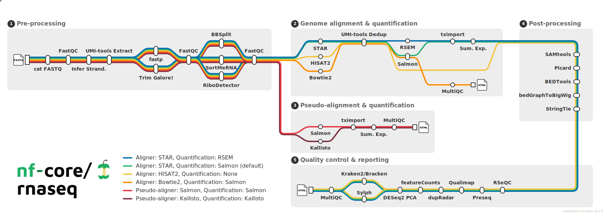

# Running the nf-core/rnaseq pipeline

**Pipeline documentation**: https://nf-co.re/rnaseq  
**Pipeline GitHub**: https://github.com/nf-core/rnaseq

---

## Overview

The `nf-core/rnaseq` pipeline takes raw paired-end or single-end FASTQ files and 
processes them through a standardized, reproducible workflow that includes 
quality control, adapter trimming, genome (& pseudo-) alignment, expression quantification, 
and aggregated reporting. The workflow requires as input a specifically formatted 
sample sheet, a genome fasta, and either a gtf or a gff annotation file.

By the end of the pipeline you will have: 

- Quality-checked, adapter-trimmed reads

- Genome-aligned BAM files

- Gene and isoform-level count matrices

- A comprehensive MultiQC HTML report





On UF's HiPerGator, nf-core is available as a pre-installed software module along with Nextflow. 
Both the modules can be loaded using the following commands on HiPerGator:

```bash
module load nf-core
module load nextflow/25.10.4

```

---

## Pipeline Components and Tools

| Key Steps | Tool(s) | Purpose | Required? |
|---|---|---|---|
| Validation of inputs | Custom script | Check input file formats | ✅ Default |
| Raw and post-trim read QC | FastQC | Assess quality of raw reads | ✅ Default |
| Adapter trimming | Trim Galore | Remove adapters and low-quality bases | ✅ Default |
| rRNA removal | SortMeRNA | Filter ribosomal RNA contamination | ⬜ Optional |
| Genome alignment | STAR | Splice-aware alignment to reference genome | ✅ (STAR-RSEM) |
| Alignment QC | RSeQC, Qualimap, SAMtools | Assess alignment quality, strandedness, coverage uniformity | ✅ Default |
| Duplicate marking | picard MarkDuplicates | Flag PCR/optical duplicates | ✅ Default |
| Library complexity | Preseq | Estimate library complexity and sequencing saturation | ⬜ Optional |
| Quantification | RSEM | Gene and isoform-level expression estimation | ✅ (STAR-RSEM) |
| Aggregated QC | MultiQC | Compile all QC metrics into one HTML report | ✅ Default |

---

## Alignment and Quantification Options

The pipeline offers several aligner/quantifier combinations. We prefer to use **STAR-RSEM** in this workshop:

| Option | Aligner | Quantifier | Best For |
|---|---|---|---|
| `star_rsem` ✅ | STAR | RSEM | Standard DE analysis; gene  & isoform-level quantification |
| `star_salmon` | STAR | Salmon | Faster quantification; large cohorts |
| `hisat2_salmon` | HISAT2 | Salmon | Lower memory usage; resource-constrained environments |

**STAR-RSEM** is preferred for standard differential expression analysis because 
it produces high-quality alignment BAM files (useful for QC) and uses 
RSEM's probabilistic model to handle multi-mapping reads more accurately. 

---

## Prerequisites

Before launching the pipeline, the following files are required:

1. **Sample sheet** (CSV format)
2. **Genome FASTA file** 
3. **Genome annotation file** (GTF preferred, uncompressed)
4. **Nextflow config file** (HPC-specific settings)
5. **STARIndex** (optional, time-saving option, STAR-Indexed genome file)
5. **Parameters YAML file** (optional, but good to define pipeline parameters)
6. **SLURM submission script** (optional, good practice)

---

## Step 1: Prepare the Sample Sheet

The sample sheet is a comma-separated file that tells the pipeline where 
your FASTQ files are

```csv
sample,fastq_1,fastq_2,strandedness,seq_platform
SRR12546980,/blue/bioinf_workshop/share/nfcore_rnaseq_files/inputs/fastq/SRR12546980.fastq,,auto,ILLUMINA
SRR12546982,/blue/bioinf_workshop/share/nfcore_rnaseq_files/inputs/fastq/SRR12546982.fastq,,auto,ILLUMINA
SRR12546984,/blue/bioinf_workshop/share/nfcore_rnaseq_files/inputs/fastq/SRR12546984.fastq,,auto,ILLUMINA
SRR12546986,/blue/bioinf_workshop/share/nfcore_rnaseq_files/inputs/fastq/SRR12546986.fastq,,auto,ILLUMINA
SRR12546988,/blue/bioinf_workshop/share/nfcore_rnaseq_files/inputs/fastq/SRR12546988.fastq,,auto,ILLUMINA
SRR12546990,/blue/bioinf_workshop/share/nfcore_rnaseq_files/inputs/fastq/SRR12546990.fastq,,auto,ILLUMINA

```
### Column Descriptions
| Column | Description |
|------------------------------------|------------------------------------|
| `sample` | A unique sample identifier. This becomes the column header in the count matrix. Use short, descriptive, alphanumeric names with no spaces. |
| `fastq_1` | Path to the R1 (forward) FASTQ file. Can be relative to your launch directory or an absolute path. |
| `fastq_2` | Path to the R2 (reverse) FASTQ file. Leave empty for single-end data (not recommended). |
| `strandedness` | Library strandedness. Options: `auto`, `forward`, `reverse`, `unstranded`. We recommend `auto`. |
| `seq_platform` | Describe sequencing platforms or centers if different. Optional |

### Important Rules
Locations of R1 and R2 can be paths relative to the location where the workflow 
is being launched or absolute paths. Fastq files should be gzipped. 
In cases where a sample id occurs in more than one row of the table, 
the workflow assumes these are separate sequencing runs of the same sample and 
counts estimation will be aggregated across rows with the same value for sample.

While strand configuration can be manually specified, we prefer to use Salmon's auto-detect
function, which will also account for cases when the set of samples include data where the 
strandedness is unknown (e.g. SRA accessions without detailed metadata), mistakenly specified, 
or where issues with reagents led to a strand-specific kit producing a library 
without strand specificity.

## Step 2: Prepare the Genome Files

Genome FASTA

- Must be gzipped (e.g., genome.fna.gz)
- Download from Ensembl or NCBI for your organism of interest

Genome Annotation (GTF)

- Must be uncompressed (.gtf, not .gtf.gz)
- Ensembl GTF files are preferred — they follow a consistent format that is fully compatible with all pipeline tools
- NCBI GTF files can be used but may cause the following error due to missing gene_id attributes:

The genome and the gtf files need to be from the same source. 

```
ERROR: failed to find the gene identifier attribute in the 9th column of the provided GTF file.
```

The nf-core ecosystem was built to work optimally with annotation files from 
Ensembl. In most cases, it will work with NCBI annotation files. 
However, for both Ensembl and NCBI, the gtf versions of the annotation files are preferred.

For NCBI annotations, the workflow will occasionally fail because there are 
subset of (typically manually curated) features for which there isn't a value 
for gene_id in the attributes (9th) column of the gtf (or gff) file. A typical 
error message of this type starts with something like this:

ERROR: failed to find the gene identifier attribute in the 9th column of the provided GTF file.
In addition, warnings, or in some cases job failure will occur if there is a 
value for gene_biotype, so we use an additional argument --skip_biotype_qc in 
our workflow that skips a biotype-based expression QC metric. This applies to 
both NCBI gff and gtf files.


## Step 3: Prepare the  Nextflow Config File

The config file (nextflow_rnaseq.config) tells Nextflow how to interact with 
HiPerGator's SLURM scheduler and how much compute resource to request per job. 
To use HiPerGator resources, you need to specify a line at the beginning of 
the process block indicating the executor, and an additional line below with 
partition names to use.

This configuration file offers flexibility beyond available parameters 
to tweak the intermediate tools used. Save this file as `nextflow_rnaseq.config`.

```
/*
~~~~~~~~~~~~~~~~~~~~~~~~~~~~~~~~~~~~~~~~~~~~~~~~~~~~~~~~~~~~~~~~~~~~~~~~~~~~~~~~~~~~~~~~
    Nextflow config file for RNA-Seq analysis
~~~~~~~~~~~~~~~~~~~~~~~~~~~~~~~~~~~~~~~~~~~~~~~~~~~~~~~~~~~~~~~~~~~~~~~~~~~~~~~~~~~~~~~~
    Defines additional resources for a large dataset.

    Simple use as follows:
        nextflow run nf-core/rnaseq -profile test,<docker/singularity> --outdir <OUTDIR>

----------------------------------------------------------------------------------------
*/

process {
  executor="slurm"
  clusterOptions="--account=cancercenter-dept --qos=cancercenter-dept-b"
}


process {
  withName: 'NFCORE_RNASEQ:RNASEQ:DUPRADAR' {
    time = 80.h
    memory = 48.GB
    cpus = 6
  }
}
process {
  withName: 'NFCORE_RNASEQ:RNASEQ:DUPRADAR' {
    errorStrategy = 'ignore'
  }
}

process {
        errorStrategy = {
        task.attempt <= 3 ? "retry" : "finish"
        }
}

params.igenomes_base = '/orange/cancercenter-dept/GENOMES/iGenomes'
```

## Step 4: Write the Parameters YAML File

Rather than putting all parameters in the SLURM script command, storing them in
a YAML file makes your runs more readable, reproducible, and easy to version-control.
Save this file as `params.yaml`.

```
---
# General Parameters
input: "samplesheet.csv"                             # Path to the sample sheet, keep as is if running from same directory
outdir: "/blue/bioinf_workshop/share/nfcore_rnaseq_files/outputs"                                     # Output directory for results
email: "kshirlekar@ufl.edu"                          # Email for notifications
multiqc_title: "TestData_RNASEQ_Multiqc"               # Title for MultiQC report

# Input Files
fasta: "/blue/bioinf_workshop/share/nfcore_rnaseq_files/inputs/genome_files/genome.fa"
gtf: "/blue/bioinf_workshop/share/nfcore_rnaseq_files/inputs/genome_files/genes.gtf"

# Alignment
aligner: "star_rsem"                                 # Aligner to use (STAR + RSEM)
star_index: "/blue/bioinf_workshop/share/nfcore_rnaseq_files/inputs/genome_files/STARIndex"

# iGenomes
igenomes_ignore: true                                # Ignore default iGenomes settings

# PRocess skipping
skip_preseq: false

```

## Step 5: Write the SLURM Submission Script

This script submits the Nextflow pipeline manager itself as a SLURM job. 
Nextflow then submits each pipeline step as its own SLURM job internally. Save this file
as 'rnaseq.sh`.

```
#!/bin/bash
#SBATCH --job-name=nfcorernaseq
#SBATCH --nodes=1
#SBATCH --ntasks=1
#SBATCH --cpus-per-task=1
#SBATCH --mem=8Gb
#SBATCH --qos=cancercenter-dept
#SBATCH --account=cancercenter-dept
#SBATCH --time=24:00:00
#SBATCH --output=LOG/rnaseq.out
#SBATCH --error=LOG/rnaseq.err

# Load the necessary modules to enable the pipeline
module load nf-core
module load nextflow/25.10.4

# Saves the singularity image in shared directory, everyone can reuse it instead of downloading it
export NXF_SINGULARITY_CACHEDIR=/blue/bioinf_workshop/share/singularity_cache


# nextflow pull nf-core/rnaseq # this is to update the pipeline to the latest version. nextflow pulls is from Github.

nextflow run nf-core/rnaseq -r 3.23.0 \
        -c nextflow.config \
        -profile singularity \
        -params-file params.yaml \ # Provide correct path
        --save_reference \ # Optional, time consuming step, good practice to save it once and reuse it later
        --skip_preseq FALSE # This is for QC, time consuming step, feel free to make is TRUE

# save_reference is optional argument
# Add -resume to resume the same workflow
```

⚠️ Always pin the pipeline version with -r (e.g., -r 3.23.0). 
This ensures your results are reproducible and not affected by future pipeline updates. 
Check available versions at https://github.com/nf-core/rnaseq/releases

## Submitting and Monitoring the Pipeline

Once all the input files are ready and present in the right folders, the pipeline 
can be initiated using the following command.

⚠️ Do not run this from your home directory. You should have created a separate folder
in your shared directory for the run. 

### Submit the job
```
sbatch rnaseq.sh
```

### Check job status

```
squeue -u your_username
```

### Monitor progress in real time
```
tail -f LOG/rnaseq.out
```

### Check for errors
```
tail -f logs/rnaseq.err
```


## Pipeline Outputs

Once complete, your output directory will look like:

```
outputs/star_rsem/
├── fastqc/                         # Raw read QC (FastQC)
│  ├── raw
│  └── trim
└── trimgalore                      # Trimmed reads and Trim Galore reports
├── star_rsem/                      # Alignment and quantification outputs
│   ├── *.Aligned.sortedByCoord.out.bam
│   ├── *.Aligned.toTranscriptome.out.bam
│   ├── *.genes.results             # Individual rsem counts, can be used for DE analysis
│   ├── *.isoforms.results
│   ├── rsem.merged.gene_counts.tsv       ← ✅ Use this for DE analysis
│   ├── rsem.merged.transcript_counts.tsv
│   ├── rsem.merged.gene_tpm.tsv
│   └── rsem.merged.transcript_tpm.tsv
├── samtools_stats/                 # Alignment statistics
├── rseqc/                          # RNA-specific alignment QC
├── qualimap/                       # Coverage and bias QC
├── preseq/                         # Library complexity estimates
├── picard_metrics/                 # Duplicate marking reports
├── dupradar/                       # Duplication rate estimates
├── multiqc/
│   └── star_rsem/
│       └── multiqc_report.html     ← ✅ Start here for QC review
└── pipeline_info/                  # Nextflow execution reports
```


✅ The key output for differential expression analysis is r
sem.merged.gene_counts.tsv — a matrix of raw estimated counts with genes as 
rows and samples as columns.

### After successful execution:

Review the MultiQC report (multiqc/star_rsem/multiqc_report.html) — see the QC 
module guide and proceed to differential expression analysis in R.
