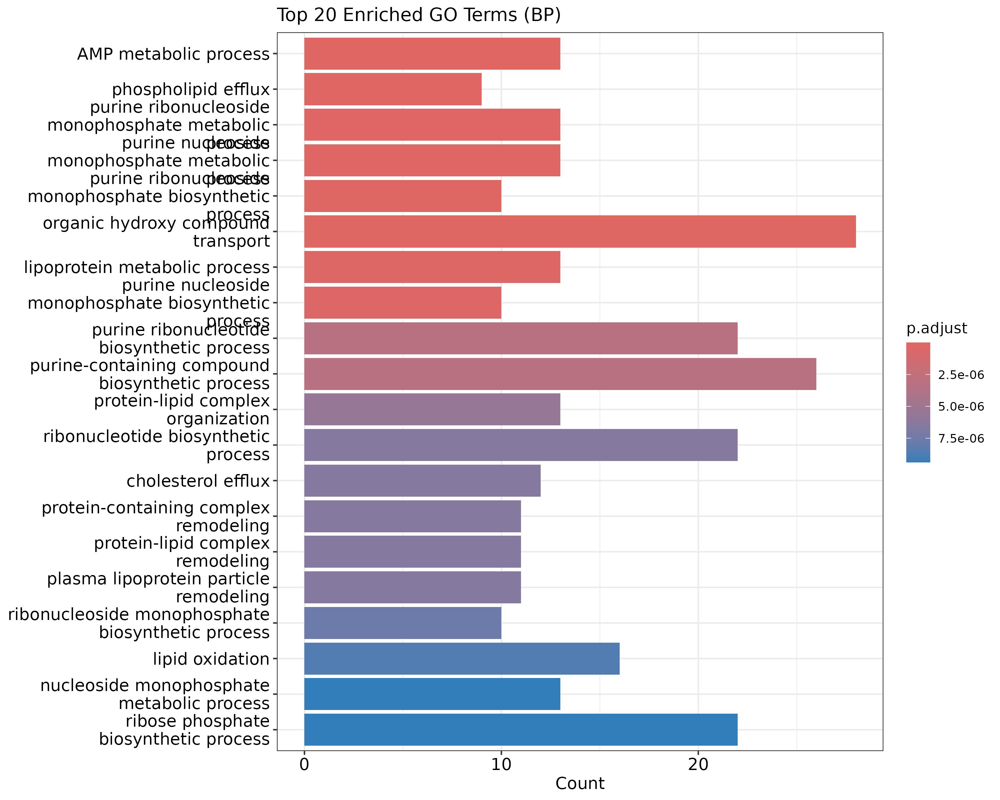
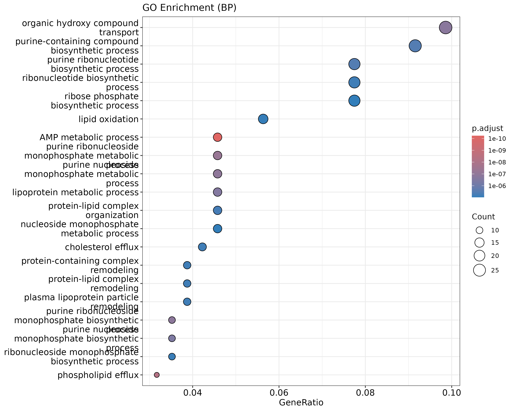
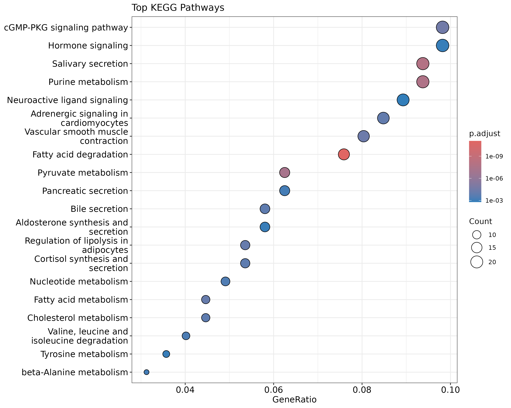
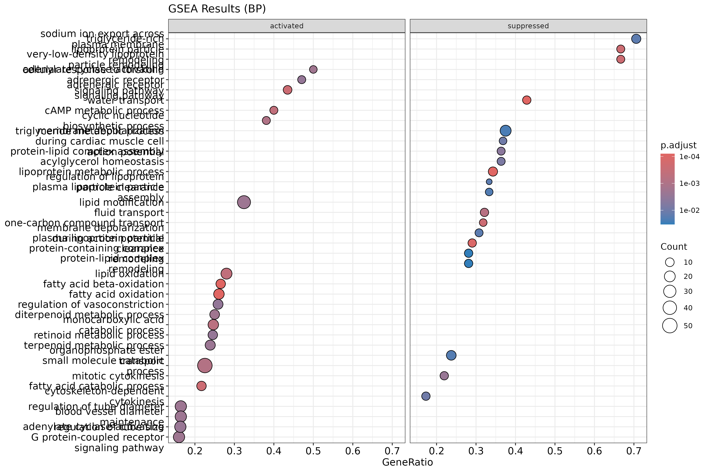
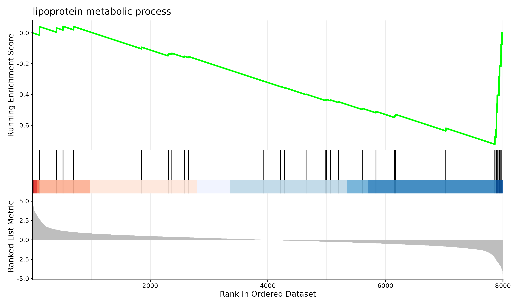

# Pathway Analysis

After identifying differentially expressed genes, the next step is to understand what biological processes, functions, or pathways they are involved in. Rather than interpreting genes one by one, pathway analysis methods ask whether genes associated with particular biological processes are enriched among your DE results.

This page covers two complementary approaches: **Gene Ontology (GO) enrichment analysis** and **Gene Set Enrichment Analysis (GSEA)**. Both are implemented in the `clusterProfiler` R package.

For the full worked analysis using our demo dataset, see the workshop notebook in `demo-analysis/rnaseq_workshop_session2.qmd`.

## Required Packages

```r
if (!require("BiocManager", quietly = TRUE))
    install.packages("BiocManager")
BiocManager::install(c("clusterProfiler", "org.Hs.eg.db", "enrichplot", "ggplot2"))
```

```r
library(clusterProfiler)
library(org.Hs.eg.db)
library(enrichplot)
library(ggplot2)
```

## Preparing Your Gene List

Both methods require a list of genes in a specific format. `clusterProfiler` works best with Entrez gene IDs, so we first need to convert gene symbols to Entrez IDs.

```r
# Starting from your DE results table (e.g. output of topTable)
# Assuming gene symbols are the row names
gene_symbols <- rownames(all_genes)

# Convert gene symbols to Entrez IDs
entrez_ids <- bitr(gene_symbols,
                   fromType = "SYMBOL",
                   toType = "ENTREZID",
                   OrgDb = org.Hs.eg.db)

head(entrez_ids)
```

## The Universe Argument

A critical concept in GO and KEGG enrichment analysis is the **universe** — the background set of genes against which enrichment is tested. The universe should be all genes that were tested for differential expression, i.e. all genes remaining after `filterByExpr`, not just the significant ones.

By default, if you do not specify a universe, `clusterProfiler` will use all genes in the annotation database as the background. This is almost always wrong for RNA-seq data — your experiment only measured a subset of all annotated genes, and using the full genome as background will inflate your enrichment statistics and produce misleading results.

```r
# The universe is ALL genes that were tested for DE
all_tested_genes <- rownames(all_genes)

# Convert universe to Entrez IDs
universe_entrez <- bitr(all_tested_genes,
                        fromType = "SYMBOL",
                        toType = "ENTREZID",
                        OrgDb = org.Hs.eg.db)
```

Always pass `universe = universe_entrez$ENTREZID` to your enrichment functions, as shown in the examples below.

> **Note:** GSEA does not require a universe argument because it uses the full ranked list of all tested genes rather than a threshold-based significant/not-significant split.

## Gene Ontology Enrichment Analysis

GO enrichment analysis tests whether genes in your DE results are statistically over-represented in particular GO terms. GO terms are organized into three categories:

- **BP** (Biological Process): pathways and larger processes
- **MF** (Molecular Function): molecular activities of gene products
- **CC** (Cellular Component): where gene products are active

### Running GO Enrichment

```r
# Get significantly DE genes (FDR < 0.05)
sig_genes <- rownames(all_genes[all_genes$adj.P.Val < 0.05,])

# Convert to Entrez IDs
sig_entrez <- bitr(sig_genes,
                   fromType = "SYMBOL",
                   toType = "ENTREZID",
                   OrgDb = org.Hs.eg.db)

# Run GO enrichment for Biological Process
go_results <- enrichGO(gene = sig_entrez$ENTREZID,
                       universe = universe_entrez$ENTREZID,
                       OrgDb = org.Hs.eg.db,
                       ont = "BP",
                       pAdjustMethod = "BH",
                       pvalueCutoff = 0.05,
                       qvalueCutoff = 0.05,
                       readable = TRUE)

head(as.data.frame(go_results))
```

### Visualizing GO Results

A bar plot of the top enriched GO terms:

```r
barplot(go_results, showCategory=20, title="Top 20 Enriched GO Terms (BP)")
ggsave("figures/go_barplot.png", width=10, height=8)
```

{width=50%}

A dot plot, which also shows gene ratio:

```r
dotplot(go_results, showCategory=20, title="GO Enrichment (BP)")
ggsave("figures/go_dotplot.png", width=10, height=8)
```

{width=50%}

## KEGG Pathway Analysis

KEGG (Kyoto Encyclopedia of Genes and Genomes) pathway analysis tests against curated biological pathways rather than GO terms.

```r
kegg_results <- enrichKEGG(gene = sig_entrez$ENTREZID,
                            universe = universe_entrez$ENTREZID,
                            organism = "hsa",
                            pAdjustMethod = "BH",
                            pvalueCutoff = 0.05)

head(as.data.frame(kegg_results))

dotplot(kegg_results, showCategory=20, title="Top KEGG Pathways")
ggsave("figures/kegg_dotplot.png", width=10, height=8)
```

{width=50%}

## Gene Set Enrichment Analysis (GSEA)

Unlike GO and KEGG enrichment which require a hard threshold for DE genes, GSEA uses the full ranked list of genes. Genes are ranked by a metric — here we use log fold change — and the method tests whether genes in a set tend to cluster at the top or bottom of the ranked list.

```r
# Create a named ranked gene list (all genes, not just significant ones)
gene_list <- all_genes$logFC
names(gene_list) <- rownames(all_genes)
gene_list <- sort(gene_list, decreasing=TRUE)

# Convert names to Entrez IDs
entrez_map <- bitr(names(gene_list),
                   fromType="SYMBOL",
                   toType="ENTREZID",
                   OrgDb=org.Hs.eg.db)

gene_list_entrez <- gene_list[entrez_map$SYMBOL]
names(gene_list_entrez) <- entrez_map$ENTREZID
gene_list_entrez <- sort(gene_list_entrez, decreasing=TRUE)

# Run GSEA with GO terms
gsea_results <- gseGO(geneList = gene_list_entrez,
                      OrgDb = org.Hs.eg.db,
                      ont = "BP",
                      pAdjustMethod = "BH",
                      pvalueCutoff = 0.05)

head(as.data.frame(gsea_results))
```

### Visualizing GSEA Results

```r
dotplot(gsea_results, showCategory=20, split=".sign") +
    facet_grid(.~.sign) +
    ggtitle("GSEA Results (BP)")
ggsave("figures/gsea_dotplot.png", width=12, height=8)
```

{width=50%}

```r
gseaplot2(gsea_results, geneSetID=1, title=gsea_results$Description[1])
ggsave("figures/gsea_enrichment_plot.png", width=10, height=6)
```

{width=50%}

## Interpreting Results

- **GO terms are hierarchical and redundant** — many highly significant terms may be testing overlapping sets of genes. The `simplify()` function in clusterProfiler can help reduce redundancy.
- **GSEA and ORA are complementary** — it is common to see somewhat different results from the two approaches, and both can provide useful biological insight.
- **Pathway databases are incomplete** — not all genes have GO annotations or KEGG pathway membership, so some DE genes will not be captured.
- **Results are only as good as your DE analysis** — pathway analysis amplifies both the signal and the noise from your upstream results.

## Further Reading

- [clusterProfiler documentation](https://bioconductor.org/packages/release/bioc/vignettes/clusterProfiler/inst/doc/clusterProfiler.html)
- [Gene Ontology Consortium](http://geneontology.org/)
- [KEGG database](https://www.genome.jp/kegg/)
