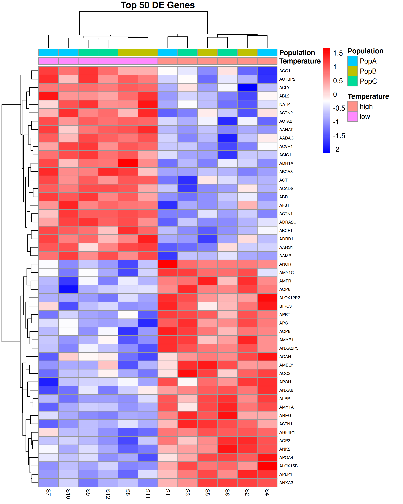
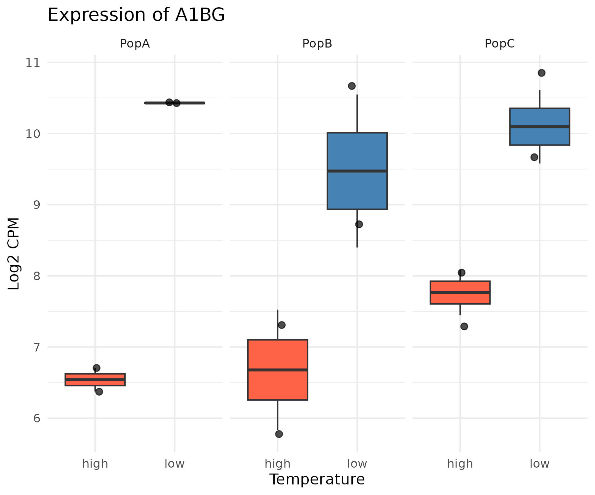

# Visualization

This page covers the most common visualizations used to explore and present RNA-seq differential expression results. For the full worked analysis using our demo dataset, see the workshop notebook in `demo-analysis/rnaseq_workshop_session2.qmd`.

## Required Packages

```r
library(tidyverse)
library(ggplot2)
library(ggrepel)
library(pheatmap)
library(RColorBrewer)
```

## Volcano Plot

A volcano plot shows log fold change on the x-axis and statistical significance (-log10 adjusted p-value) on the y-axis, allowing you to quickly identify genes that are both statistically significant and biologically meaningful in terms of effect size.

```r
# Starting from your full results table (all genes, output of topTable)
# Add a significance category column
all_genes$significance <- case_when(
    all_genes$adj.P.Val < 0.05 & all_genes$logFC > 1  ~ "Up",
    all_genes$adj.P.Val < 0.05 & all_genes$logFC < -1 ~ "Down",
    all_genes$adj.P.Val < 0.05                         ~ "Significant",
    TRUE                                                ~ "Not Significant"
)

# Add gene names for labeling top genes
all_genes$gene <- rownames(all_genes)

# Plot
volcano_plot <- ggplot(all_genes, aes(x=logFC, y=-log10(adj.P.Val), color=significance)) +
    geom_point(alpha=0.5, size=1) +
    scale_color_manual(values=c("Up"="red",
                                "Down"="blue",
                                "Significant"="orange",
                                "Not Significant"="grey")) +
    geom_vline(xintercept=c(-1, 1), linetype="dashed", alpha=0.5) +
    geom_hline(yintercept=-log10(0.05), linetype="dashed", alpha=0.5) +
    geom_text_repel(data=subset(all_genes, adj.P.Val < 0.001 & abs(logFC) > 2),
                    aes(label=gene), size=3, max.overlaps=20) +
    labs(title="Volcano Plot",
         x="Log2 Fold Change",
         y="-Log10 Adjusted P-value",
         color="Significance") +
    theme_minimal()

print(volcano_plot)
ggsave("figures/volcano_plot.png", width=8, height=6, dpi=300)
```


## Heatmap

A heatmap shows expression levels across all samples for a set of genes of interest, typically the top differentially expressed genes. It is useful for visualizing patterns of co-expression and confirming that samples cluster as expected.

```r
# Get top 50 DE genes by adjusted p-value
top50_genes <- rownames(topTable(fit, coef="temperaturelow",
                                  adjust="BH", number=50, sort.by="P"))

# Extract log-CPM values for these genes
logcpm <- cpm(DGE, log=TRUE)
top50_logcpm <- logcpm[top50_genes,]

# Z-score normalize rows for better visualization
top50_scaled <- t(scale(t(top50_logcpm)))

# Create sample annotation
annotation_col <- data.frame(
    Temperature = sample_info$temp,
    Population = sample_info$population,
    row.names = sample_info$sample
)

# Plot
pheatmap(top50_scaled,
         annotation_col = annotation_col,
         scale = "none",
         cluster_rows = TRUE,
         cluster_cols = TRUE,
         show_rownames = TRUE,
         show_colnames = TRUE,
         main = "Top 50 DE Genes",
         fontsize_row = 6,
         fontsize_col = 8,
         color = colorRampPalette(c("blue", "white", "red"))(100),
         filename = "figures/heatmap_top50.png",
         width = 8,
         height = 10)
```



## Boxplots for Individual Genes

After identifying genes of interest from your DE results, it is often useful to plot the expression of individual genes across samples to visualize the effect size and within-group variability.

```r
# Extract log-CPM for a gene of interest
gene_of_interest <- "your_gene_name"

gene_expr <- data.frame(
    expression = as.numeric(logcpm[gene_of_interest,]),
    temperature = sample_info$temp,
    population = sample_info$population,
    sample = sample_info$sample
)

# Boxplot colored by temperature, faceted by population
boxplot <- ggplot(gene_expr, aes(x=temperature, y=expression, fill=temperature)) +
    geom_boxplot(outlier.shape=NA) +
    geom_jitter(width=0.1, size=2, alpha=0.7) +
    facet_wrap(~population) +
    scale_fill_manual(values=c("high"="tomato", "low"="steelblue")) +
    labs(title=paste("Expression of", gene_of_interest),
         x="Temperature",
         y="Log2 CPM",
         fill="Temperature") +
    theme_minimal() +
    theme(legend.position="none")

print(boxplot)
ggsave(paste0("figures/boxplot_", gene_of_interest, ".png"), width=6, height=5, dpi=300)
```



## Results Tables

### Viewing Results in RStudio

The `topTable` function returns a data frame that can be viewed interactively in RStudio:

```r
# View top 20 DE genes sorted by p-value
top20 <- topTable(fit, coef="temperaturelow",
                  adjust="BH", number=20, sort.by="P")
View(top20)
```

### Exporting Results to File

```r
# Create output directory
if (!dir.exists("results")) dir.create("results")

# Export all genes
all_genes <- topTable(fit, coef="temperaturelow",
                      adjust="BH", number=Inf, sort.by="P")
write.csv(all_genes, file="results/de_results_all_genes.csv", row.names=TRUE)

# Export only significant genes
sig_genes <- all_genes[all_genes$adj.P.Val < 0.05,]
write.csv(sig_genes, file="results/de_results_significant.csv", row.names=TRUE)
```

### Filtering and Summarizing Results

```r
# How many genes are significant at FDR < 0.05?
sum(all_genes$adj.P.Val < 0.05)

# How many are up vs down regulated?
table(all_genes$adj.P.Val < 0.05, all_genes$logFC > 0)

# Filter to genes with large effect size and high significance
strong_de <- all_genes %>%
    filter(adj.P.Val < 0.05) %>%
    filter(abs(logFC) > 2) %>%
    arrange(adj.P.Val)

head(strong_de)
```

## Further Reading

- [ggplot2 documentation](https://ggplot2.tidyverse.org/)
- [pheatmap documentation](https://cran.r-project.org/web/packages/pheatmap/pheatmap.pdf)
- [ggrepel documentation](https://ggrepel.slowkow.com/)
